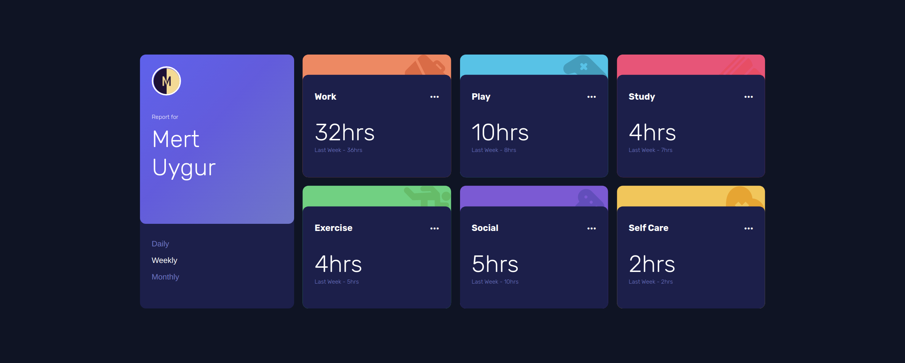

# Frontend Mentor - Time tracking dashboard solution

This is a solution to the [Time tracking dashboard challenge on Frontend Mentor](https://www.frontendmentor.io/challenges/time-tracking-dashboard-UIQ7167Jw). Frontend Mentor challenges help you improve your coding skills by building realistic projects.

## Table of contents

- [Overview](#overview)
  - [The challenge](#the-challenge)
  - [Screenshot](#screenshot)
  - [Links](#links)
- [My process](#my-process)
  - [Built with](#built-with)
  - [What I learned](#what-i-learned)
  - [Continued development](#continued-development)
- [Author](#author)

## Overview

### The challenge

Users should be able to:

- View the optimal layout for the site depending on their device's screen size
- See hover states for all interactive elements on the page
- Switch between viewing Daily, Weekly, and Monthly stats

### Screenshot

### Links

- Solution URL: [https://www.frontendmentor.io/solutions/time-tracking-dashboard-with-gulpjs-and-vanilla-js-grid-layout-94t-l1fBY](https://www.frontendmentor.io/solutions/time-tracking-dashboard-with-gulpjs-and-vanilla-js-grid-layout-94t-l1fBY)
- Live Site URL: [https://fm-time-tracking-dashboard.vercel.app/](https://fm-time-tracking-dashboard.vercel.app/)

## My process

### Built with

- Semantic HTML5 markup
- SCSS
- Flexbox
- CSS Grid
- Desktop-first workflow
- No frameworks used.

### What I learned

Almost in every part of the application, I used CSS grid layout. Area property of grid is really powerful and can be applied everywhere. In VanillaJS, handling state can be a little bit difficult, but I managed it anyway.

### Continued development

A popup menu can be shown when user clicks three dots, but I think the application is enough for now.

## Author

- Website - [https://merd.dev/](https://merd.dev/)
- Frontend Mentor - [@Mert18](https://www.frontendmentor.io/profile/Mert18)
